

<!-- Cada seção é um SVG animado gerado por scripts/ — edite os scripts, não os SVGs.
     O princípio do dia e a telemetria se atualizam sozinhos toda madrugada (GitHub Actions). -->

<a href="https://ericksilva.dev">
  
</a>

  

## ◈ Manifesto


> Software de verdade nasce da harmonia precisa entre lógica robusta, arquitetura limpa e uma experiência humana memorável.

Atuo na convergência entre a **engenharia de software estruturada** e o **design de interface fluido**. Não crio apenas código funcional: desenvolvo soluções completas, escaláveis e eficientes, garantindo que cada linha de código sustente uma experiência de usuário impecável.

Duas frentes que se apoiam: a interface nasce de uma decisão visual, e essa decisão só se sustenta se o código aguentar o peso dela.

## ◈ Stack


## ◈ Como trabalho


## ◈ Projetos em destaque

  <a href="https://edutrack-ericksikva.vercel.app"></a>
  <a href="https://briefing-digital.vercel.app"></a>

  <a href="https://github.com/ErickLarssen/port"></a>
  <a href="https://github.com/ErickLarssen/cinerick"></a>

Repositórios: <a href="https://github.com/ErickLarssen/edutrack">EduTrack</a> · <a href="https://github.com/ErickLarssen/briefing-digital">Briefing Digital</a> · <a href="https://github.com/ErickLarssen/port">Portfólio</a> · <a href="https://github.com/ErickLarssen/cinerick">Cinerick</a>

## ◈ Princípio do dia


## ◈ Atividade


 

<a href="https://ericksilva.dev">
  
</a>
